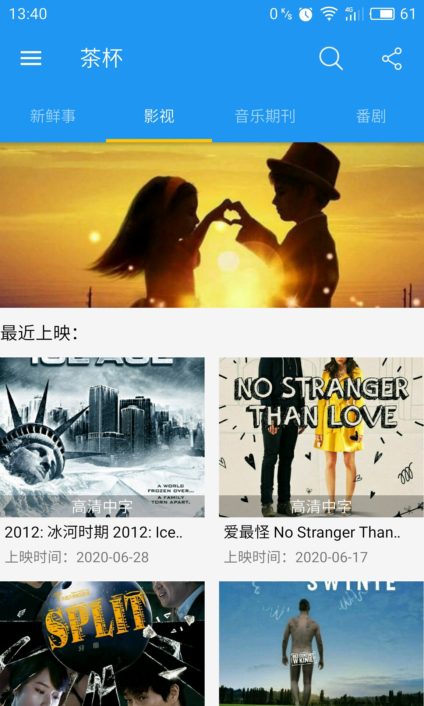
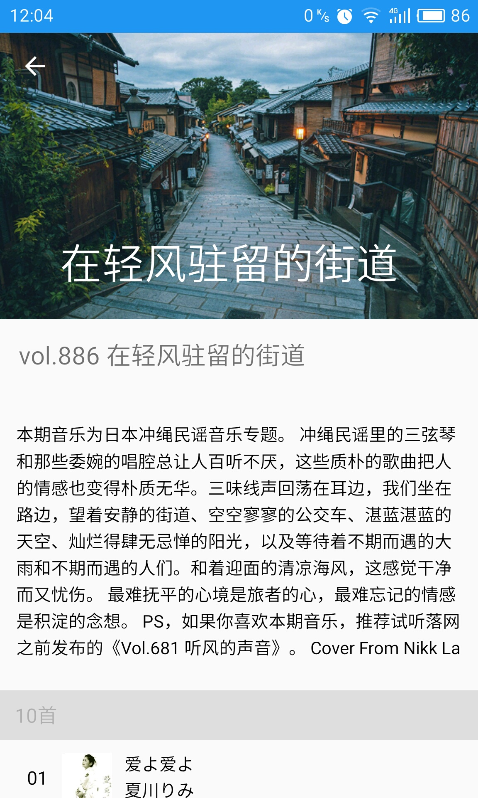
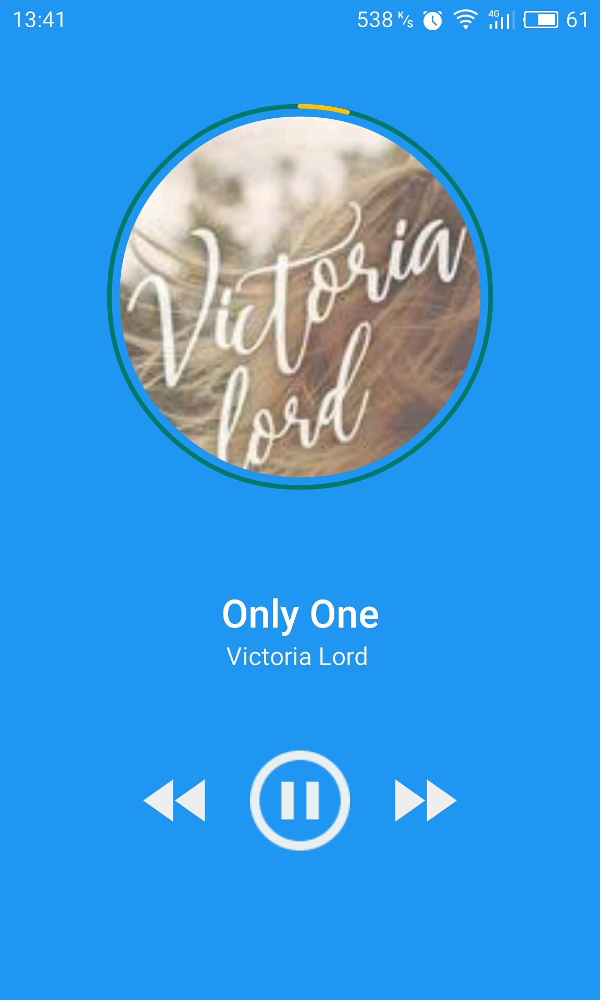
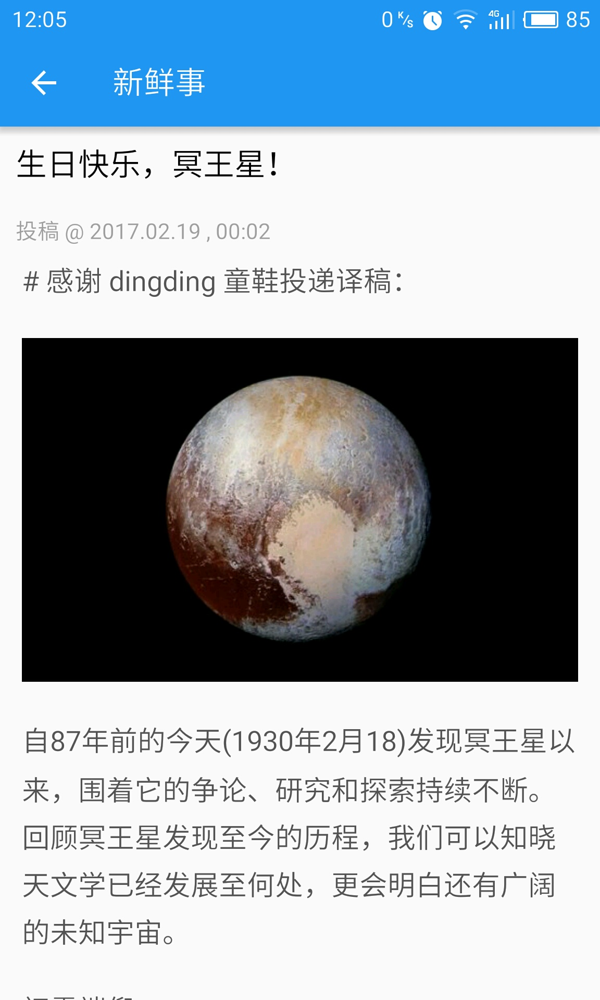
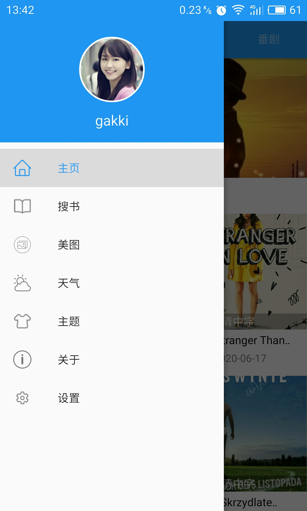
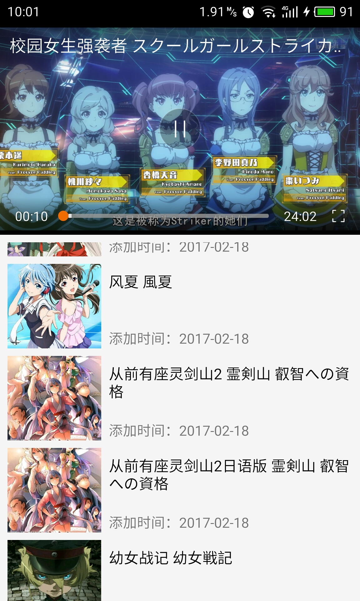
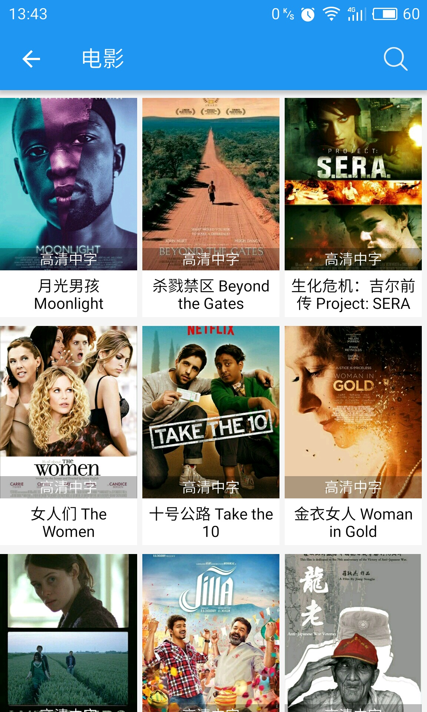

# TeaCup
A Material Design app for entertainment

##functional list

- fine interface
- read fresh news
- read excellent article
- hear the unique music
- listen to the radio
- view picture

##ScreenShot

## Implementation

### Data

Most data are fetched from network while some of them are cached for offline.

- okhttp with custom extensions for network requests.
- Gson for data model.
- Glide for image loading.
- jsoup for parse html.

Data sources:

- [煎蛋网](http://jandan.net/)
- [豆瓣读书](https://book.douban.com/)
- [神马电影网](http://www.94sm.com/)
- [落网](http://www.luoo.net/)
- [糗事百科](http://www.qiushibaike.com/)
- [第一弹](http://www.diyidan.com/)

### UI

- Material Design implemented with AppCompat, Design, CardView and RecyclerView from support library and some customization.
- Animation implemented with shared element transition on Lollipop and above.

### location
Use Baidu maps to locate.

## Libraries created for this project

- [MiniMusicView](https://github.com/henryblue/MiniMusicView)
- [MxVideoPlayer](https://github.com/henryblue/MxVideoPlayer)
- [okhttp](https://github.com/square/okhttp)
- [xrecyclerview](https://github.com/jianghejie/XRecyclerView)
- [circleimageview](https://github.com/hdodenhof/CircleImageView)
- [materialdialog](https://github.com/drakeet/MaterialDialog)

## Third party libraries

- [PhotoView](https://github.com/chrisbanes/PhotoView)
- [Glide](https://github.com/bumptech/glide)
- [Gson](https://github.com/google/gson)
- [jsoup](https://jsoup.org/download)

## Building

You can download the APK file from [releases](/teacup-1.2_1.apk) of this project.
